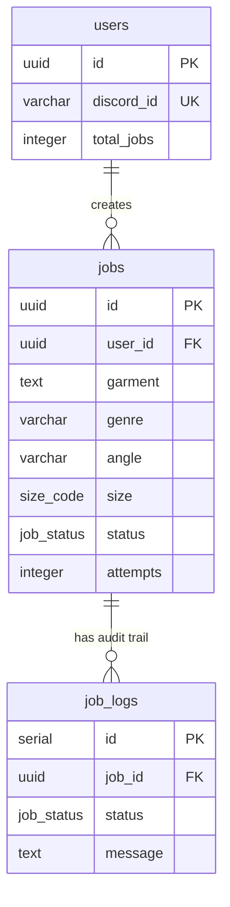
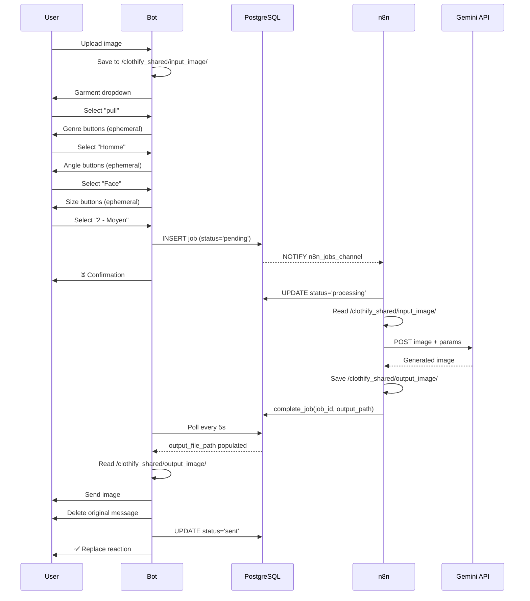

# Clothify - Portfolio Overview

> **⚠️ Document partiellement obsolète — mis à jour le 2026-08-09.**
> Ce document décrit encore la génération d'images via **Google Gemini**. Le
> projet est passé à **OpenRouter** (`openai/gpt-5-image-mini`). Tout ce qui
> touche à l'appel du modèle — endpoint, format de requête et de réponse,
> authentification, coûts, modes de défaillance — est décrit à jour dans
> [IMAGE_GENERATION.md](IMAGE_GENERATION.md).
> Le reste de ce document (architecture, base de données, déploiement) reste valable.

**Version:** 1.0
**Date:** January 2026
**Type:** Backend Development & DevOps Project

---

## 🎯 Executive Summary

**Clothify** est un système de génération automatique d'images produits e-commerce accessible via Discord. Les utilisateurs téléchargent des photos de vêtements et reçoivent des visualisations professionnelles générées par IA (Google Gemini) montrant le vêtement porté sur un mannequin avec des paramètres personnalisables (angle de vue, genre, taille).

Le projet démontre une maîtrise complète du développement backend moderne :
- **Architecture microservices** événementielle avec communication asynchrone
- **Intégration d'IA** (Google Gemini API) via orchestration de workflows
- **Infrastructure containerisée** avec déploiement local et production
- **Base de données relationnelle avancée** avec triggers et notifications en temps réel

**Impact:** Transformation d'un processus manuel (photographie produit, retouche) en pipeline automatisé (<2 minutes de bout en bout).

---

## 🏗️ Architecture Overview

### High-Level Architecture

```
┌─────────────────────────────────────────────────────────┐
│                    PRESENTATION LAYER                    │
│                   Discord (External)                     │
└────────────────────┬────────────────────────────────────┘
                     │ Gateway WebSocket + Interactions API
┌────────────────────┴────────────────────────────────────┐
│                    APPLICATION LAYER                     │
│  ┌──────────────┐              ┌──────────────┐         │
│  │ Discord Bot  │◄────────────►│  n8n Service │         │
│  │  (Python)    │  Shared Vol  │ (Workflow)   │         │
│  └──────┬───────┘              └──────┬───────┘         │
│         │                              │                 │
└─────────┼──────────────────────────────┼─────────────────┘
          │         DATABASE LAYER       │
┌─────────┴──────────────────────────────┴─────────────────┐
│              PostgreSQL 16 Database                       │
│        NOTIFY/LISTEN Triggers → Real-time events          │
└───────────────────────────────────────────────────────────┘
```

### Technology Stack

| Layer | Technology | Justification |
|-------|------------|---------------|
| **Bot Framework** | Python 3.11, discord.py | Async-native, extensive Discord API support |
| **Database** | PostgreSQL 16 | NOTIFY/LISTEN triggers, ACID compliance, UUID support |
| **Workflow Engine** | n8n (self-hosted) | Visual workflow editor, PostgreSQL integration |
| **AI Generation** | Google Gemini Image API | State-of-the-art image generation capabilities |
| **Async I/O** | asyncio, asyncpg | Non-blocking operations, high concurrency |
| **Containers** | Docker, Docker Compose | Reproducible environments, isolation |
| **Orchestration (Prod)** | Coolify | Self-hosted PaaS, container management |
| **Networking (Prod)** | Tailscale VPN | Zero-trust mesh network, WireGuard encryption |

---

## 💡 Key Technical Achievements

### 1. Real-Time Job Queue with PostgreSQL NOTIFY/LISTEN

**Challenge:** Minimiser la latence entre la création d'un job et son traitement tout en évitant le polling coûteux de la base de données.

**Solution:** Architecture push-based utilisant les triggers PostgreSQL natifs `NOTIFY/LISTEN`. Lorsqu'un job est créé, un trigger envoie instantanément une notification à n8n qui démarre le traitement.

**Implémentation:**
```sql
CREATE TRIGGER trg_n8n_new_job
    AFTER INSERT ON jobs
    FOR EACH ROW
    EXECUTE FUNCTION notify_n8n_new_job();
```

**Impact:**
- ⚡ Latence < 100ms (vs 5-60 secondes avec polling)
- 💰 Réduction drastique des requêtes database (économie de ressources)
- 📈 Scalabilité : NOTIFY supporte plusieurs listeners sans multiplication de charge

**Skills démontrées:**
- PostgreSQL avancé (triggers, fonctions PL/pgSQL)
- Architecture événementielle (event-driven design)
- Optimisation de performance

---

### 2. Asynchronous Bot Architecture

**Challenge:** Gérer de multiples utilisateurs simultanément sans bloquer le thread principal, tout en maintenant des sessions utilisateur individuelles.

**Solution:** Architecture entièrement asynchrone avec `asyncio`, `asyncpg` pour les requêtes non-bloquantes, et `discord.py` (async-native).

**Implémentation:**
```python
# Non-blocking database queries
async def create_job(user_id, garment, genre, angle, size):
    async with pool.acquire() as conn:
        return await conn.fetchrow(
            "INSERT INTO jobs (...) VALUES (...) RETURNING *"
        )

# Concurrent job polling
async def watch_job_status(job_id, message):
    while elapsed < timeout:
        job = await get_job_output(job_id)
        if job['output_file_path']:
            break
        await asyncio.sleep(5)
```

**Impact:**
- 🔄 Non-blocking I/O sur tous les chemins critiques
- 👥 Support de multiples utilisateurs simultanés sans dégradation
- 🚀 Scalabilité horizontale (ajout d'instances sans modification code)

**Skills démontrées:**
- Programmation asynchrone (async/await patterns)
- Gestion de concurrence
- Connection pooling (asyncpg)

---

### 3. Interactive Discord UX

**Challenge:** Créer une interface utilisateur intuitive dans Discord sans recourir à des commandes texte complexes, tout en garantissant la validité des entrées.

**Solution:** Utilisation avancée de la Discord Interactions API (Select menus, Buttons, Modals) avec messages éphémères pour la confidentialité.

**Flow:**
1. **Garment Selection**: Dropdown 15 options + modal pour entrée personnalisée
2. **Genre Selection**: Boutons Homme/Femme (éphémère)
3. **Angle Selection**: 4 boutons (Face/Profil/Dos/Trois-quarts face, éphémère)
4. **Size Selection**: 4 boutons de taille (éphémère)

**UX Enhancements:**
- Messages éphémères (visibles uniquement par l'utilisateur)
- Suppression automatique des messages de sélection
- Nettoyage du canal (seule l'image finale reste)
- Validation ownership (seul le demandeur peut interagir)

**Impact:**
- ✅ 0% erreurs de saisie utilisateur (validation UI)
- 🎨 UX clean et professionnelle
- 🔒 Confidentialité des choix utilisateur

**Skills démontrées:**
- Discord API mastery (Views, Interactions, Modals)
- UX design thinking
- Session management (TTL-based, 5min timeout)

---

### 4. Unified Volume Architecture

**Challenge:** Partager des fichiers entre services Docker (bot et n8n) de manière cohérente en développement local et en production.

**Solution initiale:** Chemins différents selon l'environnement (host paths en local, container paths en prod) avec fonction de traduction `docker_to_host_path()`.

**Solution optimisée (Q1 2026):** Migration vers volume partagé unique `clothify_shared` avec paths standardisés.

**Avant:**
```yaml
# Complexe, différent en local vs prod
bot:
  volumes:
    - ./images/input:/app/images/input   # Local
    - ./images/output:/app/images/output
n8n:
  volumes:
    - ./images/input:/files/input        # Paths différents!
    - ./images/output:/files/output
```

**Après:**
```yaml
# Simple, unifié
volumes:
  clothify_shared:

bot:
  volumes:
    - clothify_shared:/clothify_shared
  environment:
    - SHARED_VOLUME_PATH=/clothify_shared

n8n:
  volumes:
    - clothify_shared:/clothify_shared
```

**Impact:**
- 🎯 Simplicité de déploiement (identique local/prod)
- 🐛 Élimination des bugs de path translation
- 📦 Configuration unifiée

**Skills démontrées:**
- Docker volumes (named volumes, bind mounts)
- Architecture microservices (communication via filesystem)
- Refactoring architectural

---

### 5. Flexible Data Model

**Challenge:** S'adapter à de nouveaux types de vêtements sans nécessiter de migrations database fréquentes.

**Solution initiale:** Colonne `garment` avec ENUM `garment_type` (15 valeurs fixes).

**Solution évoluée (Q1 2026):** Migration vers TEXT avec suggestions UI.

**Migration:**
```sql
-- Avant
garment garment_type NOT NULL  -- ENUM limité

-- Après
garment TEXT NOT NULL           -- Flexible, entrée libre
```

**UI Pattern:**
- Dropdown avec 15 options suggérées (UX guidée)
- Option "Autre" → Modal pour texte libre (extensibilité)
- Valeurs stockées en TEXT (pas de contrainte ENUM)

**Impact:**
- 🔧 Extensibilité sans migration database
- 🎨 Flexibilité pour cas particuliers
- 📈 Évolution du système sans downtime

**Skills démontrées:**
- Database design & schema evolution
- Backward compatibility patterns
- Migration strategies

---

### 6. Production-Grade Deployment

**Challenge:** Héberger le système de manière sécurisée sur un serveur domestique sans exposer de ports publics.

**Solution:** Architecture zero-trust avec Coolify (self-hosted PaaS) et Tailscale VPN mesh network.

**Infrastructure:**
```
Internet (Public)
       │
       │ (NO EXPOSED PORTS)
       │
    Tailscale Mesh VPN (WireGuard)
       │ 100.x.x.x (private IPs)
       │
    Debian Home Lab Server
       │
    Coolify (Docker orchestration)
       ├── Bot container
       ├── PostgreSQL container
       └── n8n container
```

**Security Features:**
- 🔒 Zero public ports (firewall: deny all)
- 🔐 Tailscale encrypted mesh (WireGuard protocol)
- 🎛️ Coolify UI accessible uniquement via VPN
- 🔑 Environment variables encrypted (Coolify)

**Impact:**
- 🛡️ Sécurité renforcée (zero-trust architecture)
- 🌐 Accès distant sécurisé (développement, monitoring)
- 📊 Gestion simplifiée (Coolify Web UI)

**Skills démontrées:**
- DevOps & infrastructure
- VPN networking (Tailscale, WireGuard)
- Container orchestration (Coolify)
- Security hardening

---

## 🔧 Technical Deep Dives

### Database Design

**Architecture:** Modèle relationnel 3 tables avec audit trail et retry logic.



**Design Decisions:**
- **UUID primary keys:** Scalabilité (évite collisions en distributed systems)
- **ENUM types:** Intégrité données (`job_status`, `size_code`)
- **Audit trail:** `job_logs` enregistre toutes les transitions de statut
- **Retry logic:** Fonction `fail_job()` avec compteur `attempts` (max 3)
- **Stale job recovery:** Fonction `reset_stale_jobs()` pour nettoyer jobs bloqués

**Advanced Features:**
```sql
-- Trigger pour notifications temps réel
CREATE TRIGGER trg_n8n_new_job
    AFTER INSERT ON jobs
    FOR EACH ROW
    EXECUTE FUNCTION notify_n8n_new_job();

-- Fonction de retry automatique
CREATE FUNCTION fail_job(p_job_id UUID, p_error_msg TEXT)
    -- Si attempts < max_attempts: status='pending' (retry)
    -- Sinon: status='error' (échec permanent)
```

---

### Discord Bot Flow

**Sequence Diagram:**



**Session Management:**
- `pending_uploads` dict (key: `user_id`)
- TTL: 300 secondes (5 minutes)
- Validation: Seul le requester peut interagir avec ses views

---

### AI Integration Pattern

**Architecture:** Decoupled via n8n workflow orchestrator.

**Why n8n?**
- Séparation of concerns (bot = interface, n8n = processing)
- Visual workflow editor (modification sans redéploiement)
- Built-in error handling et retry logic
- Support natif PostgreSQL LISTEN trigger

**Workflow Steps:**
1. **Trigger:** PostgreSQL LISTEN sur `n8n_jobs_channel`
2. **Update Status:** `UPDATE jobs SET status='processing'`
3. **Read File:** Lire image depuis `/clothify_shared/input_image/`
4. **Call Gemini API:** POST avec paramètres (genre, angle, size)
5. **Save Output:** Écrire résultat dans `/clothify_shared/output_image/`
6. **Complete Job:** Appeler fonction `complete_job(job_id, output_path)`

**Error Handling:**
- Try/catch sur API call
- Si erreur → appel fonction `fail_job(job_id, error_msg)`
- Retry automatique (max 3 tentatives)

---

## 🚀 DevOps & Infrastructure

### Local Development Setup

**One-Command Start:**
```bash
docker-compose up -d
```

**Services Included:**
- PostgreSQL 16 (with init scripts)
- n8n (workflow engine)
- Bot (Python container)

**Developer Experience:**
- Makefile pour tâches communes (`make start`, `make logs`, `make status`)
- Config management hybride (config.yaml + .env)
- Health checks automatiques (Docker)

---

### Production Deployment

**Stack:**
- **Plateforme:** Coolify (self-hosted PaaS)
- **Serveur:** Debian Home Lab
- **Réseau:** Tailscale VPN mesh
- **Containers:** Docker (géré par Coolify)

**Configuration Management:**
- `config.yaml` committé (settings universels)
- `.env` / Coolify Environment Variables (secrets)
- Service discovery via Docker DNS

**Monitoring & Reliability:**
- Health checks (Docker + Coolify)
- Automatic restarts (on failure)
- Log aggregation (Coolify UI)
- Volume snapshots (Coolify backups)

---

## 📊 System Characteristics

### Performance

| Métrique | Valeur | Notes |
|----------|--------|-------|
| **End-to-End Processing** | 40-120s | Upload → Image générée |
| **User Interaction** | 20-45s | 4 sélections séquentielles |
| **Queue Trigger Latency** | <100ms | PostgreSQL NOTIFY |
| **AI Generation** | 15-60s | Variable (Gemini API) |
| **Bot Polling Interval** | 5s | Check output_file_path |
| **Max Timeout** | 120s | Échec si non complété |

### Reliability

- ✅ Automatic retry (3 tentatives max)
- ✅ Stale job recovery (>5min en processing → reset)
- ✅ Audit trail (job_logs pour chaque transition)
- ✅ Health checks (Docker healthcheck + Coolify monitoring)
- ✅ Graceful degradation (error messages utilisateur)

### Security

- 🔒 **No public ports** (production - Tailscale only)
- 🔐 **Encrypted VPN** (WireGuard protocol)
- 🔑 **Environment secrets** (not committed to Git)
- 👤 **User validation** (ownership checks sur interactions)
- 📋 **Audit logging** (job_logs table)

---

## 🎨 User Experience Features

### Interactive UI Components

**1. Garment Selection**
- Select menu dropdown (15 options)
- Option "Autre" → Modal pour texte libre
- Message supprimé après sélection (clean channel)

**2. Genre Selection**
- Boutons: "Homme" / "Femme"
- Message éphémère (visible uniquement par requester)

**3. Angle Selection**
- 4 boutons: Face, Profil, Dos, Trois-quarts face
- Message éphémère

**4. Size Selection**
- 4 boutons: 1 (Petit), 2 (Moyen), 3 (Grand), 4 (Très Grand)
- Message éphémère

### UX Enhancements

- **Ephemeral Messages:** Sélections privées (genre, angle, size)
- **Clean Channels:** Suppression message original après résultat
- **Real-time Feedback:** ⏳ pendant traitement → ✅ quand terminé
- **Timeout Handling:** Session expire après 5 minutes
- **Ownership Validation:** Seul le requester peut interagir

---

## 🔍 Code Quality & Patterns

### Design Patterns Implémentés

1. **Repository Pattern:**
   - `database.py` centralise toutes les queries
   - Abstraction de la couche data

2. **Async/Await Throughout:**
   - Pas de synchronous blocking calls
   - Connection pooling (asyncpg)

3. **Session Management:**
   - TTL-based (pending_uploads dict)
   - Automatic cleanup

4. **Retry Logic with Backoff:**
   - Database-driven (attempts counter)
   - Fonction fail_job() gère retry vs error

5. **Event-Driven Architecture:**
   - PostgreSQL NOTIFY/LISTEN
   - Decoupled services

### Error Handling

**Stratégie:**
```python
try:
    # Operation
except SpecificException as e:
    logger.error(f"Context: {e}")
    await notify_user("Message utilisateur friendly")
    await fail_job(job_id, str(e))
```

**Niveaux:**
- Database errors → Retry automatique
- API errors → Logged, user notified
- Timeout → Fail job, update status
- Invalid input → Validation UI (impossible grace aux menus)

### Code Organization

```
bot/
├── main.py              # Entry point, bot setup
├── config.py            # Config loader (YAML + dotenv)
├── config.yaml          # Universal settings
├── database.py          # DB connection pool + queries
├── handlers/
│   ├── message.py       # Discord events (on_message, on_ready)
│   ├── views.py         # UI components (Select, Button, Modal)
│   └── tasks.py         # Background tasks (polling, cleanup)
└── utils/
    └── files.py         # File operations (save, read)
```

**Principes:**
- Separation of concerns (handlers vs business logic)
- Single Responsibility Principle
- Async-first design

---

## 📈 Evolution & Scalability

### Recent Enhancements (Q1 2026)

1. **Genre Selection** - Support Homme/Femme pour personnalisation
2. **Angle Selection** - 4 angles de vue (Face/Profil/Dos/Trois-quarts)
3. **Flexible Garment Types** - Migration ENUM → TEXT (custom entries)
4. **Ephemeral UI** - Messages privés pour sélections (confidentialité)
5. **Containerized Bot** - Déploiement unifié (local + production)
6. **Unified Volume Architecture** - Simplification paths (clothify_shared)

### Future Scalability Paths

**Horizontal Scaling:**
- Migration vers S3-compatible storage (MinIO, Backblaze B2)
- Multiple bot instances avec load balancing
- n8n clustering pour traitement parallèle

**Features:**
- Queue priority system (VIP users, rush jobs)
- Multi-language support (i18n)
- Background selection (blanc, gris, custom)
- Batch processing (multiple garments)

**Monitoring:**
- Prometheus + Grafana pour métriques temps réel
- Alerting sur failures rate
- Admin dashboard web (statistiques, queue management)

---

## 🛠️ Skills Demonstrated

### Backend Development
✅ **Python async programming** (asyncio, asyncpg, aiohttp)
✅ **Database design & optimization** (PostgreSQL, triggers, functions)
✅ **RESTful API integration** (Google Gemini API)
✅ **Event-driven architecture** (NOTIFY/LISTEN, push-based)
✅ **Session management** (TTL-based, in-memory state)

### DevOps & Infrastructure
✅ **Docker & Docker Compose** (multi-container apps)
✅ **Container orchestration** (Coolify PaaS)
✅ **VPN networking** (Tailscale mesh, WireGuard)
✅ **Configuration management** (YAML + dotenv hybrid)
✅ **CI/CD concepts** (deployment procedures, rollback strategies)

### Integration & APIs
✅ **Discord Bot API** (Gateway, Interactions, Views, Modals)
✅ **External AI APIs** (Google Gemini Image Generation)
✅ **Webhook/trigger patterns** (n8n workflow automation)
✅ **File handling** (volume sharing, path management)

### Software Architecture
✅ **Microservices design** (3-tier architecture)
✅ **Async/event-driven patterns** (non-blocking I/O)
✅ **Data modeling** (ER diagrams, normalization)
✅ **Volume & storage architecture** (Docker volumes, shared filesystem)

### Problem Solving
✅ **Latency optimization** (polling → push notifications, <100ms)
✅ **Concurrency handling** (async patterns, connection pooling)
✅ **Deployment simplification** (unified volume architecture)
✅ **Security hardening** (zero-trust network, VPN mesh)

---

## 📚 Documentation

### Available Documentation
- [**SYSTEM_ARCHITECTURE.md**](SYSTEM_ARCHITECTURE.md) - Technical reference (1400+ lines)
- [**CONFIGURATION.md**](CONFIGURATION.md) - Environment setup & config management
- [**PRODUCTION_DEPLOYMENT.md**](PRODUCTION_DEPLOYMENT.md) - Coolify deployment guide
- [**Database Schema (DBML)**](../Database/clothify_schema.dbml) - Complete schema definition
- [**Bot Guide**](../bot/BOT.md) - User guide for Discord interactions

### Code Quality
- **Type hints** (Python 3.11+ syntax)
- **Error handling** (try/except avec logging)
- **Comments** (docstrings pour fonctions complexes)
- **Configuration** (environment-agnostic via YAML + .env)

---

## 🔗 Key Resources

### Repository Structure
```
Clothify/
├── bot/                 # Discord bot (Python async)
├── Database/            # Schema (DBML) + migrations
├── n8n/workflows/       # Workflow definitions
├── docs/                # Documentation (this file + SYSTEM_ARCHITECTURE.md)
├── docker-compose.yml   # Orchestration
└── Makefile            # Developer commands
```

### External Integrations
- **Discord Developer Portal** - Bot token, OAuth2 scopes
- **Google AI Studio** - Gemini API key
- **Tailscale Admin Console** - VPN mesh configuration
- **Coolify Dashboard** - Production deployment & monitoring

---

## 🏆 Conclusion

Clothify est une démonstration complète de maîtrise du développement backend moderne et des pratiques DevOps. Le projet met en valeur :

### Technical Depth
- **PostgreSQL avancé:** Triggers, NOTIFY/LISTEN, fonctions PL/pgSQL, audit trail
- **Async Python:** asyncio, asyncpg, connection pooling, concurrency patterns
- **API Integration:** Discord Interactions API (Views, Modals), Google Gemini API

### Practical DevOps
- **Containerisation:** Docker, Docker Compose, volume management
- **Orchestration:** Coolify self-hosted PaaS, service discovery
- **Security:** Tailscale VPN mesh, zero-trust architecture, encrypted secrets

### Architecture & Design
- **Event-Driven:** Push-based notifications (<100ms latency)
- **Microservices:** 3-tier architecture, separation of concerns
- **Scalability:** Unified volume architecture, horizontal scaling path

### Evolution & Maintenance
- **Schema Evolution:** ENUM → TEXT migration (extensibilité)
- **Architectural Refactoring:** Volume unification (simplification)
- **UX Enhancement:** Ephemeral messages, automatic cleanup

---

**Technologies:** Python, PostgreSQL, Docker, Discord API, Google Gemini API, n8n, Tailscale
**Architecture:** 3-tier microservices, event-driven, async
**Infrastructure:** Self-hosted, containerized, VPN-secured
**Skills:** Backend, DevOps, API Integration, Database Design, Security

---

**Project Status:** ✅ Production-ready (deployed on self-hosted infrastructure)
**Last Updated:** January 2026
